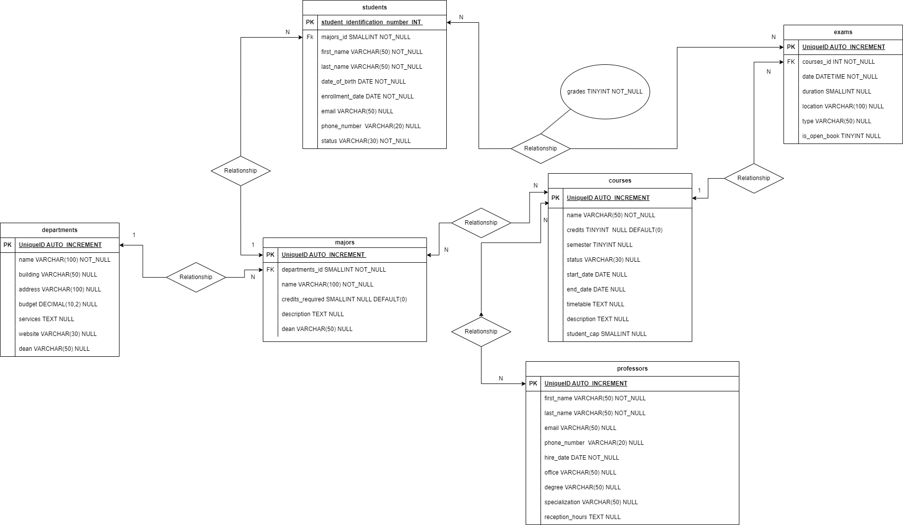

# DB University

### Descrizione

Questo progetto mira a modellizzare la struttura delle entità di un database per gestire in modo efficiente tutte le informazioni pertinenti a un'università.

L'obiettivo principale è fornire una base solida per la gestione dei dati relativi a Dipartimenti, Corsi di Laurea, Corsi, Insegnanti, Studenti ed Esami.

### Relazioni Principali

- Ogni Dipartimento può offrire diversi Corsi di Laurea

- Ogni Corso di Laurea può comprendere diversi Corsi accademici

- Ogni Corso accademico può essere tenuto da diversi Insegnanti

- Ogni Corso accademico prevede la possibilità di sostenere più appelli d'Esame

- Ogni Studente è iscritto a un solo Corso di Laurea

- Ogni Studente può iscriversi a più appelli d'Esame

- Per ogni Esame a cui partecipa uno Studente, viene memorizzato il voto ottenuto, anche se non sufficiente

### Diagramma

